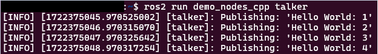
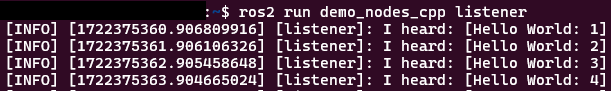
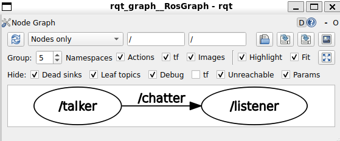

# ROS2 Talking and Listening Demo
This is a brief demo providing insight into how ROS Nodes and Services work. You will need to have ROS2 installed to complete this example (note: Provided pictures are from Ubuntu 24.04 in WSL2). 

In Demo 1, you will build your own version of this exact tutorial to learn about how it works functionally.

To complete this example, you will need to have **atleast 2** terminals open. One terminal will be the talker, sending message and the second a receiving node.

## Demo/Example
Preface: if the command `ros2` is not found you need to source the ros setup file. enter `source /opt/ros/jazzy/setup.bash`. This can be added to the `.bashrc` to prevent this step every new terminal.

1. In the first terminal run `ros2 run demo_nodes_cpp talker`. This will start the first demo node sending a message. 

2. In the second terminal run `ros2 run demo_nodes_cpp listener`. This node is listening for messages from the talker node. If no messages are being received, start or restart talker node.

3. To view a graph of the nodes communicating, run `rqt_graph`. This will display an interactive menu of the nodes currently running and how they are communicating.

4. To stop nodes, use `Ctrl + C` the standard way to cancel running programs in the terminal.